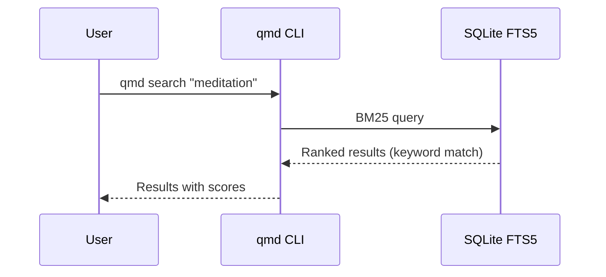
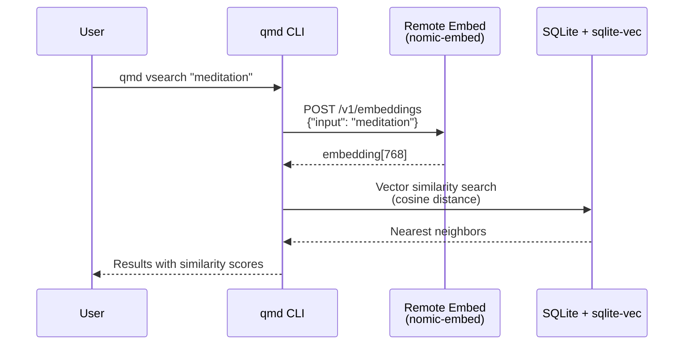
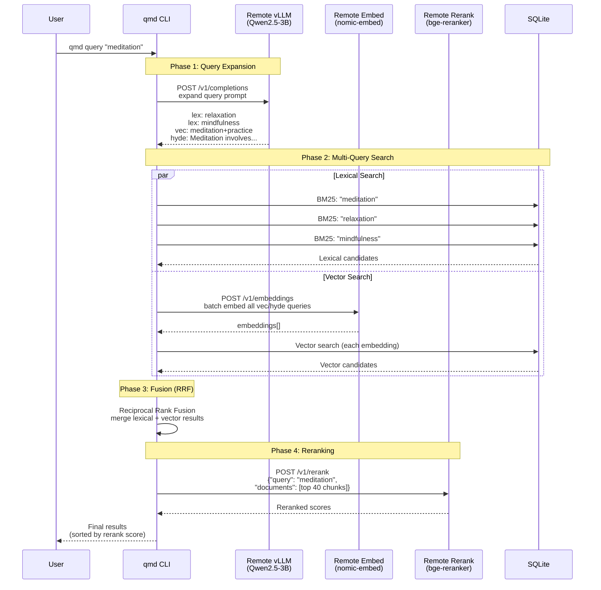
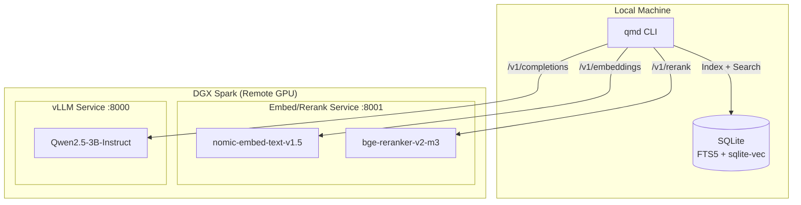
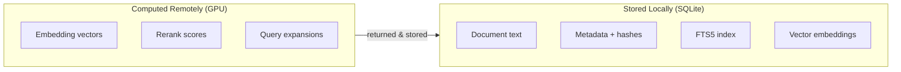

# QMD Search Flows

Sequence diagrams illustrating the data flow for each search command.

## `qmd search` - BM25 Keyword Search

Pure local operation using SQLite FTS5.

## `qmd vsearch` - Vector Similarity Search

Uses remote GPU for query embedding, local SQLite for vector search.

## `qmd query` - Hybrid Search with Query Expansion + Reranking

Full pipeline using both remote services.

## Service Architecture

## Data Storage

All data remains local. Remote services are stateless compute.

